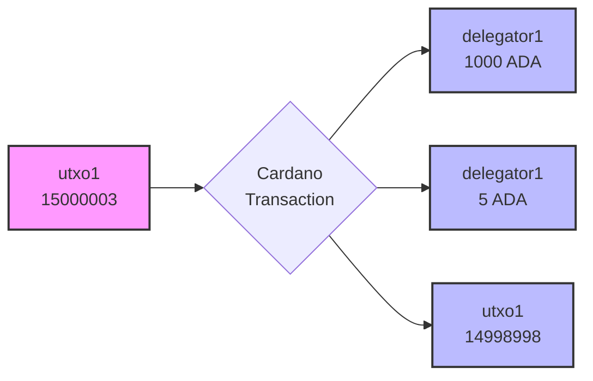

# Introduction to `cardano-testnet`

The primary tool we'll use is **`cardano-testnet`**. It’s a powerful utility for creating a complete, private Cardano testnet that runs entirely on your local machine. This is the same tool used in the `cardano-node` CI pipeline to test and validate the protocol itself, so you're using what the core developers use.

The main advantage of `cardano-testnet` is the **total control** it gives you. Instead of waiting on public testnets, you can instantly create a clean, isolated environment. You can customize any on-chain parameter that would normally require a governance action, such as block sizes, transaction fees, or cost models. This lets you rapidly test specific scenarios in minutes, not days.

To get started, you'll need `cardano-testnet` along with `cardano-node` and `cardano-cli`. The easiest way to get all three is to download the latest pre-compiled binaries from the official GitHub releases page:

`https://github.com/IntersectMBO/cardano-node/releases`

### Installing tools

Open a terminal on your linux machine and download the tarball:

```shell
wget https://github.com/IntersectMBO/cardano-node/releases/download/10.4.1/cardano-node-10.4.1-linux.tar.gz
```
Now we can extract its contents and install the binaries in our PATH

```shell
tar -xf cardano-node-10.4.1-linux.tar.gz
```

You should see somehting like this: 

```shell
tree bin
bin
├── bech32
├── cardano-cli
├── cardano-node
├── cardano-node-chairman
├── cardano-profile
├── cardano-submit-api
├── cardano-testnet
├── cardano-timeline
├── cardano-topology
├── db-analyser
├── db-synthesizer
├── db-truncater
├── locli
├── locli-quick
└── snapshot-converter

1 directory, 15 files
```

Copy the cardano-node, cardano-cli and cardano-testnet binaries to a directory that is your PATH i.e. `~/.local/bin`

```shell
cp bin/cardano-cli bin/cardano-node bin/cardano-testnet ~/.local/bin
```
### Launch a local testnet

Before you launch a local testnet, you need to set up environment variables that point to your executables

```shell
export CARDANO_CLI=~/.local/bin/cardano-cli
export CARDANO_NODE=~/.local/bin/cardano-node
```
Launching a local cluster will be a 3 step process. 

1. Dump the genesis files in your system and create the directory that will contain all the artifacts:

```shell
cardano-testnet create-env --output mytestnet --testnet-magic 42 --mainnet
```

2. Update the start time for your cluster

```shell 
cardano-testnet create-env --output mytestnet --testnet-magic 42 --update-time
```

3. Launch the cluster 

```shell
cardano-testnet cardano --node-env mytestnet --testnet-magic 42
```

You should see:
```

Testnet is running with config file /home/carlos/github/rare-evo-dev-tools-workshop/mytestnet/configuration.yaml
Logs of the SPO node can be found at /home/carlos/github/rare-evo-dev-tools-workshop/mytestnet/logs/node1/stdout.log

To interact with the testnet using cardano-cli, you might want to set:

  export CARDANO_NODE_SOCKET_PATH=/home/carlos/github/rare-evo-dev-tools-workshop/mytestnet/socket/node1/sock
  export CARDANO_NODE_NETWORK_ID=42

Type CTRL-C to exit.
```

With that, you can open a new terminal ant configure the CARDANO_NODE_SOCKET_PATH and CARDANO_NODE_NETWORK_ID environment variables to use cardano-cli 
to interact with your testnet. 

Now, let's see what has been created: 

```shell
tree -L 4 mytestnet/
```
```
mytestnet/
├── alonzo-genesis.json
├── byron-gen-command
│   └── genesis-keys.000.key
├── byron-genesis.json
├── configuration.yaml
├── conway-genesis.json
├── current-stake-pools.json
├── delegate-keys
│   ├── delegate1
│   │   ├── kes.skey
│   │   ├── kes.vkey
│   │   ├── key.skey
│   │   ├── key.vkey
│   │   ├── opcert.cert
│   │   ├── opcert.counter
│   │   ├── vrf.skey
│   │   └── vrf.vkey
│   ├── delegate2
│   │   ├── kes.skey
│   │   ├── kes.vkey
│   │   ├── key.skey
│   │   ├── key.vkey
│   │   ├── opcert.cert
│   │   ├── opcert.counter
│   │   ├── vrf.skey
│   │   └── vrf.vkey
│   ├── delegate3
│   │   ├── kes.skey
│   │   ├── kes.vkey
│   │   ├── key.skey
│   │   ├── key.vkey
│   │   ├── opcert.cert
│   │   ├── opcert.counter
│   │   ├── vrf.skey
│   │   └── vrf.vkey
│   └── README.md
├── drep-keys
│   ├── drep1
│   │   ├── drep.skey
│   │   └── drep.vkey
│   ├── drep2
│   │   ├── drep.skey
│   │   └── drep.vkey
│   ├── drep3
│   │   ├── drep.skey
│   │   └── drep.vkey
│   └── README.md
├── genesis-keys
│   ├── genesis1
│   │   ├── key.skey
│   │   └── key.vkey
│   ├── genesis2
│   │   ├── key.skey
│   │   └── key.vkey
│   ├── genesis3
│   │   ├── key.skey
│   │   └── key.vkey
│   └── README.md
├── logs
│   ├── node1
│   │   ├── node.pid
│   │   ├── stderr.log
│   │   └── stdout.log
│   ├── node2
│   │   ├── node.pid
│   │   ├── stderr.log
│   │   └── stdout.log
│   └── node3
│       ├── node.pid
│       ├── stderr.log
│       └── stdout.log
├── node-data
│   ├── node1
│   │   ├── db
│   │   ├── port
│   │   └── topology.json
│   ├── node2
│   │   ├── db
│   │   ├── port
│   │   └── topology.json
│   └── node3
│       ├── db
│       ├── port
│       └── topology.json
├── pools-keys
│   ├── pool1
│   │   ├── byron-delegate.key
│   │   ├── byron-delegation.cert
│   │   ├── cold.skey
│   │   ├── cold.vkey
│   │   ├── kes.skey
│   │   ├── kes.vkey
│   │   ├── opcert.cert
│   │   ├── opcert.counter
│   │   ├── staking-reward.skey
│   │   ├── staking-reward.vkey
│   │   ├── vrf.skey
│   │   └── vrf.vkey
│   └── README.md
├── shelley-genesis.json
├── socket
│   ├── node1
│   │   └── sock
│   ├── node2
│   │   └── sock
│   └── node3
│       └── sock
├── stake-delegators
│   ├── delegator1
│   │   ├── payment.skey
│   │   ├── payment.vkey
│   │   ├── staking.skey
│   │   └── staking.vkey
│   ├── delegator2
│   │   ├── payment.skey
│   │   ├── payment.vkey
│   │   ├── staking.skey
│   │   └── staking.vkey
│   └── delegator3
│       ├── payment.skey
│       ├── payment.vkey
│       ├── staking.skey
│       └── staking.vkey
└── utxo-keys
    ├── README.md
    ├── utxo1
    │   ├── utxo.addr
    │   ├── utxo.skey
    │   └── utxo.vkey
    ├── utxo2
    │   ├── utxo.addr
    │   ├── utxo.skey
    │   └── utxo.vkey
    └── utxo3
        ├── utxo.addr
        ├── utxo.skey
        └── utxo.vkey

39 directories, 99 files
```

You can use cardano-cli to explore your new cluster

```
cardano-cli conway query utxo --whole-utxo --output-text
                           TxHash                                 TxIx        Amount
--------------------------------------------------------------------------------------
192760c5dc9eb024add49807c395d3c090112b429165924c1d69381059f948a8     0        15000003000000 lovelace + TxOutDatumNone
24015f5c295292ad8314ae235992ca891f2f6e245062fd055c4fcaae0a79821d     0        15000003000000 lovelace + TxOutDatumNone
82b0a00b129395b50b31bf22496398c03d94815b6889cf5b60450b392f6b4580     0        15000003000000 lovelace + TxOutDatumNone
cbc7111cd5f15c08e330ec076fe12503988187b7df380f9fda323c8981308648     0        3000000000 lovelace + TxOutDatumNone
eebb82d603908ed67c179339000c7421274c4ab48e05fb3204347f989458b2a5     0        15000003000000 lovelace + TxOutDatumNone
fb28f4f215ffc54356b7a7dc88685abf7bb42041f670657d5c8f2bfa7400946a     0        15000003000000 lovelace + TxOutDatumNone
fc1807bad86a0996062829384fe4dea4b58089fece26e7774adfeafb6854f61d     0        15000003000000 lovelace + TxOutDatumNone
```

You can create addresses keys, everything you can do on a real blockchain, you can do in your local testnet. Let's for example, generate `delegator1` address:

```shell
cardano-cli conway address build \
  --payment-verification-key-file mytestnet/stake-delegators/delegator1/payment.vkey \
  --stake-verification-key-file mytestnet/stake-delegators/delegator1/staking.vkey \
  --testnet-magic 42 \
  --out-file mytestnet/stake-delegators/delegator1/payment.addr 
```

Query it's balance:

```
cardano-cli conway query utxo --address $(< mytestnet/stake-delegators/delegator1/payment.addr) --output-text
```

### Create a simple transaction

Let's send 1005 ada from `utxo1` to `delegator1`. 

```shell
cardano-cli conway query utxo \
  --address $(< mytestnet/utxo-keys/utxo1/utxo.addr) \
  --output-text
```
```shell
                           TxHash                                 TxIx        Amount
--------------------------------------------------------------------------------------
fc1807bad86a0996062829384fe4dea4b58089fece26e7774adfeafb6854f61d     0        15000003000000 lovelace + TxOutDatumNone
```
The transaction hash followed by transaction index is the utxo identifier:`TxHash#TxIx`.

Our transaction will consume one UTxO from `utxo1=15000003 ada` and create three UTxOs: `delegator1=1000ada`, `delegator1=5 ada`, `utxo1=14998998`, something like this:


To build the transaction with `cardano-cli`, do:

```shell
cardano-cli conway transaction build \
  --tx-in $(cardano-cli conway query utxo --address $(< mytestnet/utxo-keys/utxo1/utxo.addr) | jq -r 'keys[0]') \
  --tx-out $(< mytestnet/stake-delegators/delegator1/payment.addr)+1000000000 \
  --tx-out $(< mytestnet/stake-delegators/delegator1/payment.addr)+5000000 \
  --change-address $(< mytestnet/utxo-keys/utxo1/utxo.addr) \
  --out-file mytestnet/tx.raw
```

Note that the `build` command automatically calculates the transaction fees and with the option `--change-address` the cardano-cli automatically calulcates the change that is going to be send back to the specified address. 

You can inspect this transaction before sigining: 

```
cardano-cli debug transaction view --tx-file mytestnet/tx.raw
```
It will ouput something like this: 

```json
{
    "auxiliary scripts": null,
    "certificates": null,
    "collateral inputs": [],
    "currentTreasuryValue": null,
    "datums": [],
    "era": "Conway",
    "fee": "429 Lovelace",
    "governance actions": [],
    "inputs": [
        "69b11b5efa465a1607c89288f9a94f9e7c2ae2cdf489d05c38f703b03d59eb7e#0"
    ],
    "metadata": null,
    "mint": null,
    "outputs": [
        {
            "address": "addr_test1qqu7mjjtwltnvh8959h4adr0g0cu6pxc5jf92asyqn2fmyemks0845tnfn9kyc7rtflv5x2v468zwmrpdmefrhesn3hq8mhp00",
            "address era": "Shelley",
            "amount": {
                "lovelace": 1000000000
            },
            "network": "Testnet",
            "payment credential key hash": "39edca4b77d7365ce5a16f5eb46f43f1cd04d8a49255760404d49d93",
            "reference script": null,
            "stake reference": {
                "stake credential key hash": "3bb41e7ad1734ccb6263c35a7eca194cae8e276c616ef291df309c6e"
            }
        },
        {
            "address": "addr_test1qqu7mjjtwltnvh8959h4adr0g0cu6pxc5jf92asyqn2fmyemks0845tnfn9kyc7rtflv5x2v468zwmrpdmefrhesn3hq8mhp00",
            "address era": "Shelley",
            "amount": {
                "lovelace": 5000000
            },
            "network": "Testnet",
            "payment credential key hash": "39edca4b77d7365ce5a16f5eb46f43f1cd04d8a49255760404d49d93",
            "reference script": null,
            "stake reference": {
                "stake credential key hash": "3bb41e7ad1734ccb6263c35a7eca194cae8e276c616ef291df309c6e"
            }
        },
        {
            "address": "addr_test1vqp8rq07z9yllwd34v200zpa9f0324lw6nlapg3zjyvu05ckslpdn",
            "address era": "Shelley",
            "amount": {
                "lovelace": 14998997999571
            },
            "network": "Testnet",
            "payment credential key hash": "027181fe1149ffb9b1ab14f7883d2a5f1557eed4ffd0a2229119c7d3",
            "reference script": null,
            "stake reference": null
        }
    ],
    "redeemers": [],
    "reference inputs": [],
    "required signers (payment key hashes needed for scripts)": null,
    "return collateral": null,
    "scripts": [],
    "total collateral": null,
    "treasuryDonation": 0,
    "update proposal": null,
    "validity range": {
        "lower bound": null,
        "upper bound": null
    },
    "voters": {},
    "withdrawals": null,
    "witnesses": []
}
```

Note that there are no `witnesses` at the bottom of the output.
If we try to submit this transaction the node will complain "You have no right to spend this UTxO!" in other words `MissingVKeyWitnessesUTXOW`

```shell
cardano-cli conway transaction submit --tx-file mytestnet/tx.raw 
```
```
Command failed: transaction submit
Error: Error while submitting tx: ShelleyTxValidationError ShelleyBasedEraConway (ApplyTxError (ConwayUtxowFailure (MissingVKeyWitnessesUTXOW (fromList [KeyHash {unKeyHash = "027181fe1149ffb9b1ab14f7883d2a5f1557eed4ffd0a2229119c7d3"}])) :| []))
```

So, let's sign the transaction with the siging key that controls that UTxO

```
cardano-cli conway transaction sign \
  --tx-file mytestnet/tx.raw \
  --signing-key-file mytestnet/utxo-keys/utxo1/utxo.skey \
  --out-file mytestnet/tx.signed 
```

And submit the signed transaction file: 

```
cardano-cli conway transaction submit --tx-file mytestnet/tx.signed 
```
```
Transaction successfully submitted. Transaction hash is:
{"txhash":"ad39a4c724cbc8039edd5e828c788fbeb5cab465c54466284ab80eafc6ba41f7"}
```

Query the balance again:

```shell
cardano-cli conway query utxo --address $(< mytestnet/stake-delegators/delegator1/payment.addr) --output-text
```
```
                           TxHash                                 TxIx        Amount
--------------------------------------------------------------------------------------
ad39a4c724cbc8039edd5e828c788fbeb5cab465c54466284ab80eafc6ba41f7     0        1000000000 lovelace + TxOutDatumNone
ad39a4c724cbc8039edd5e828c788fbeb5cab465c54466284ab80eafc6ba41f7     1        5000000 lovelace + TxOutDatumNone
af40f069c169fed301cb90033ec88e40f40cd1406a97bbba7adc32e6d4cd961a     0        15000003000000 lovelace + TxOutDatumNone

```

Unsurprisingly, its not just that a global balance has been updated, instead we now have a two UTxOs. The original from when we started the cluster and a new one with the 1000 ada you just sent. 

And the source `utxo1` has one UTxO with the change of the transaction afdter paying transaction fees. 

```shell
cardano-cli conway query utxo \
  --address $(< mytestnet/utxo-keys/utxo1/utxo.addr) \
  --output-text
```

```
                           TxHash                                 TxIx        Amount
--------------------------------------------------------------------------------------
ad39a4c724cbc8039edd5e828c788fbeb5cab465c54466284ab80eafc6ba41f7     2        14998997999571 lovelace + TxOutDatumNone
```
